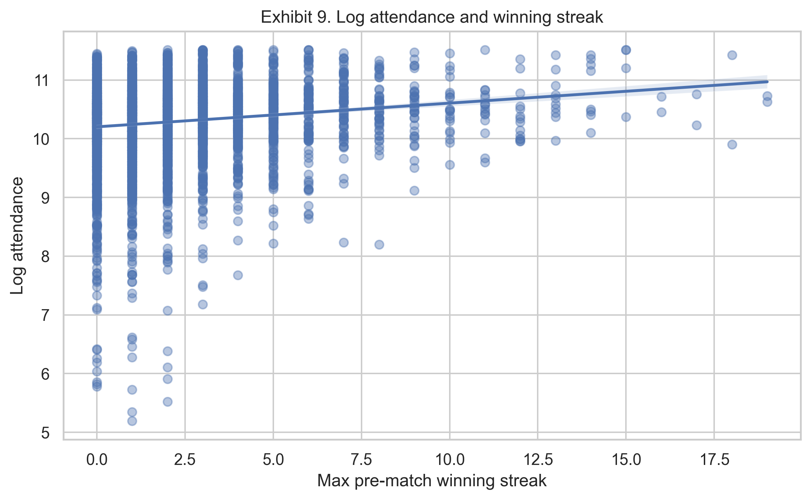

# Do Team Winning Streaks Increase AFL Match Attendance?

## Introduction

This report examines whether team winning streaks are associated with higher Australian Football League (AFL) match attendance. Attendance is economically important for clubs, stadiums and broadcasters, and understanding the factors that shape crowd demand can assist fixture planning and fan engagement.

The analysis uses match-level AFL data from 2000 to 2024 and focuses on whether the maximum pre-match winning streak of the two competing teams is descriptively associated with attendance. The analysis is explicitly descriptive, not causal. It reports conditional associations while acknowledging that unobserved factors such as team popularity, fixture attractiveness and match timing may confound the relationship.

The preferred specification estimates log attendance as a function of maximum pre-match winning streak, finals status, match margin, season fixed effects and venue fixed effects. The main finding is that one additional game in the maximum pre-match winning streak is associated with approximately a 2.7 per cent higher attendance, holding these controls constant.

## Data

The unit of observation is an AFL match, with a final analysis sample of 4,643 matches from 2000 to 2024.

Sample construction and scope. The cleaned sample retains matches with usable attendance and match metadata; observations with missing or non-positive crowd counts are excluded because the log outcome requires strictly positive values. Streak variables are constructed using only wins recorded prior to each fixture, so the maximum pre-match winning streak is determined from past results and is pre-existing relative to the recorded attendance. Because the data are match-level, the analysis cannot observe individual fan choices, ticket prices, day-of-match weather, broadcast timing or membership status, which constrains interpretation to conditional associations at the match level rather than individual-level demand responses.

Key variables are as follows. Attendance is the reported crowd size for the match. Log attendance is the natural logarithm of attendance; it is used because crowd size is right-skewed and the log scale gives an approximate percentage interpretation. Maximum pre-match winning streak is the larger of the two teams' winning streaks entering the match. Finals match is an indicator equal to one for finals matches and zero otherwise. Match margin is the final winning margin in points. Season identifies the AFL season, and venue identifies the stadium where the match was played.

Table 1 summarises these variables.

| Variable | N | Mean | SD | Median | Min | Max |
|---|---:|---:|---:|---:|---:|---:|
| Attendance | 4643 | 34439.9 | 17813.6 | 32942.0 | 180.0 | 100024.0 |
| Log attendance | 4643 | 10.281 | 0.667 | 10.403 | 5.193 | 11.513 |
| Maximum pre-match winning streak | 4643 | 1.956 | 2.349 | 1.000 | 0.000 | 19.000 |
| Match margin | 4643 | 34.4 | 26.8 | 29.0 | 0.0 | 186.0 |
| Finals match | 4643 | 0.047 | 0.211 | 0.000 | 0.000 | 1.000 |
| Season | 4643 | 2012.5 | 7.1 | 2013.0 | 2000.0 | 2024.0 |

Table 1 shows that the average AFL match in the sample attracted about 34,440 spectators and that log attendance is much less dispersed than attendance in levels. The typical maximum pre-match winning streak is one game, with longer streaks relatively rare. Only about 4.7 per cent of matches are finals.

## Empirical strategy

The preferred estimation strategy is:

`log_attendance_it = β0 + β1 max_pre_streak_it + β2 is_finals_it + β3 margin_it + γ_season + δ_venue + ε_it`

In this equation, log_attendance is the natural log of attendance for match i in season t. The key explanatory variable, max_pre_streak, is the match's maximum pre-match winning streak. The is_finals variable controls for the higher crowds typically seen in finals, while margin controls for the closeness of the contest. Season fixed effects capture year-to-year demand shifts, and venue fixed effects capture stadium capacity and location differences. HC3 robust standard errors are used to reduce sensitivity to heteroskedasticity.

Controls rationale. The set of included controls is intended to capture observable match-level factors that plausibly influence crowd demand. Finals status captures structurally higher demand for finals fixtures; margin proxies for competitiveness or perceived match quality; season fixed effects absorb league-wide demand shifts and year-specific shocks; and venue fixed effects absorb time-invariant stadium characteristics such as capacity, catchment area and facility quality that systematically affect attendance. These controls therefore help isolate the descriptive association between pre-match streaks and crowd size from variation driven by the match context.

In this log-linear specification, `β1` is interpreted approximately as the percentage change in attendance associated with one additional game in the maximum pre-match winning streak, conditional on the included controls.

The ambition of the analysis is descriptive. The model estimates conditional associations between streaks and attendance, not a causal effect. This distinction is important because team quality, supporter base size, opponent attractiveness, weather, scheduling and other unobserved factors may influence both winning streaks and crowd outcomes.

## Results

Figure 1 shows the raw relationship between the maximum pre-match winning streak and log attendance.

*Figure 1 shows the relationship between maximum pre-match winning streak and log attendance. The fitted line provides descriptive evidence that matches involving longer winning streaks tend to have higher attendance, although the raw relationship does not control for match, season or venue differences.*

Table 2 reports the main regression estimates from the preferred specification and two simpler comparisons.

| Variable / specification | Model 1 | Model 2 | Model 3 |
|---|---:|---:|---:|
| max_pre_streak | 0.040 | 0.028 | 0.027 |
|  | (0.004) | (0.003) | (0.002) |
| Finals control | No | Yes | Yes |
| Margin control | No | Yes | Yes |
| Season FE | No | Yes | Yes |
| Venue FE | No | No | Yes |
| N | 4,643 | 4,643 | 4,643 |
| R-squared | 0.020 | 0.346 | 0.734 |

Notes: Dependent variable is log attendance. HC3 robust standard errors are in parentheses. Model 1 is the raw bivariate association. Model 2 adds finals status, margin and season fixed effects. Model 3 adds venue fixed effects and is the preferred specification.

Table 2 shows that the raw association in Model 1 is positive at 0.040. Controlling for finals, margin and season in Model 2 reduces the coefficient to 0.028. The preferred Model 3 adds venue fixed effects and estimates a coefficient of 0.027 with an HC3 robust standard error of 0.002. This preferred result reflects a descriptive association conditional on match type, matchup closeness, year and stadium.

Model progression and interpretation. The three-column progression helps reveal how observable match and seasonal features relate to the raw association. Model 1 reports the simple bivariate association and therefore conflates the direct association between streaks and attendance with differences in match type, season and venue. The decline from 0.040 in Model 1 to 0.028 in Model 2 after adding finals, margin and season fixed effects indicates that a portion of the raw relationship is explained by measurable characteristics such as finals status, competitiveness and year-to-year demand shifts. Introducing venue fixed effects produces only a small further adjustment, from 0.028 to 0.027, which suggests that the positive association is not solely driven by long-streak matches occurring at inherently high-attendance venues. Overall, the coefficient pattern is consistent with observable controls explaining some, but not all, of the initial bivariate association.

Economically, a 2.7 per cent association is meaningful for an average crowd of about 34,440. On that scale, the coefficient corresponds to roughly 930 additional spectators per extra game in the maximum pre-match winning streak. This interpretation is approximate and descriptive, not a revenue or causal estimate.

## Robustness

Table 3 summarises the main robustness checks on the preferred result.

| Check | Coef. on max_pre_streak | SE | N | R-squared | What changes? |
|---|---:|---:|---:|---:|---|
| Main | 0.027 | 0.002 | 4,643 | 0.734 | Preferred model |
| No controls | 0.040 | 0.004 | 4,643 | 0.020 | Removes all controls |
| Season FE only | 0.028 | 0.003 | 4,643 | 0.346 | Removes venue fixed effects |
| Regular season only | 0.028 | 0.002 | 4,427 | 0.728 | Excludes finals |
| Excluding COVID seasons | 0.024 | 0.002 | 4,340 | 0.675 | Excludes 2020 and 2021 |
| Levels outcome | 875.990 | 77.919 | 4,643 | 0.604 | Uses attendance in people |
| Quadratic | 0.042 | 0.005 | 4,643 | 0.735 | Adds max_pre_streak squared |
| Clustered by venue | 0.027 | 0.003 | 4,643 | 0.734 | Clusters SEs by venue |

Notes: All checks use log attendance unless otherwise stated. Standard errors are HC3 robust except the final row, which clusters by venue. The quadratic specification also estimates max_pre_streak_sq = -0.002, suggesting diminishing returns at longer streak lengths.

The robustness checks confirm that the positive association is not driven solely by the preferred specification. The no-controls estimate is larger at 0.040, which is consistent with observable match, season and venue differences explaining part of the raw association. The season fixed-effects model remains positive at 0.028. Restricting the sample to regular-season matches yields 0.028 (N = 4,427), while excluding COVID seasons 2020 and 2021 yields 0.024 (N = 4,340). The level outcome returns a large coefficient in people (875.990), reflecting the change in units rather than a percentage interpretation. The quadratic specification reports a positive linear term of 0.042 and a negative squared term of -0.002, suggesting diminishing returns for very long streaks. Clustering standard errors by venue produces 0.027 with SE 0.003, supporting the result under alternative inference.

What would have made the result fragile. Several alternative patterns would materially weaken confidence in the descriptive finding. A sign reversal in alternative specifications would indicate a fundamentally different relationship; a coefficient that fell near zero after excluding finals or omitting COVID seasons would imply sensitivity to particular sample choices; a substantial loss of precision under clustered inference would reduce statistical confidence; and inconsistent signs between the log and level outcomes would show instability across outcome definitions. None of these fragility patterns appear in the checks reported here: the coefficient remains positive across specifications, and while the magnitude is somewhat smaller after controls and when COVID seasons are excluded, the sign, direction and precision are preserved.

## Discussion and conclusion

The evidence points to a consistent descriptive association between winning streaks and AFL attendance. Longer pre-match winning streaks are associated with higher crowds even after controlling for finals status, margin, season and venue.

The preferred result is not a causal claim. The estimate may reflect underlying team quality, supporter base size, fixture attractiveness, media attention or other unobserved demand factors that correlate with both streaks and attendance. The most important remaining threat is unobserved demand variation that season and venue fixed effects cannot capture. Team popularity, opponent quality, fixture attractiveness (for example rivalry or marquee matchups), match time slot and day of week, weather conditions on the match day, ticket pricing and broadcast scheduling can all influence crowd size and may be correlated with streaks. Popular teams on long runs or high-profile fixtures can produce both long streaks and large crowds; without micro-level ticketing, membership or weather data these channels cannot be separately identified here. For these reasons the preferred estimate should be understood as a robust conditional association rather than the causal effect of winning streaks.

Future research could strengthen the design by incorporating team membership or fan-base measures, ticket pricing, weather, broadcast slot and opponent quality, or by exploiting quasi-experimental variation in fixture strength or unexpected changes to team form.

In summary, the analysis finds that team winning streaks are descriptively associated with higher AFL attendance. The preferred specification estimates that an additional game in the maximum pre-match winning streak is associated with roughly 2.7 per cent higher attendance, holding finals status, match margin, season and venue fixed effects constant.

## Replication note

The GitHub repository contains the cleaned data, analysis scripts and generated outputs used in this report. Table 1 is produced by `src/final_report_outputs.py`, Figure 1 by `src/eda.py`, Table 2 by `src/primary_analysis.py`, and Table 3 by `src/robustness_analysis.py`. The README maps each report table and figure to the script and output file that produces it.

## References

AFL Tables. AFL match-level data, 2000–2024.

White, H. (1980). A heteroskedasticity-consistent covariance matrix estimator and a direct test for heteroskedasticity. Econometrica.

MacKinnon, J. G. and White, H. (1985). Some heteroskedasticity-consistent covariance matrix estimators with improved finite sample properties. Journal of Econometrics.
